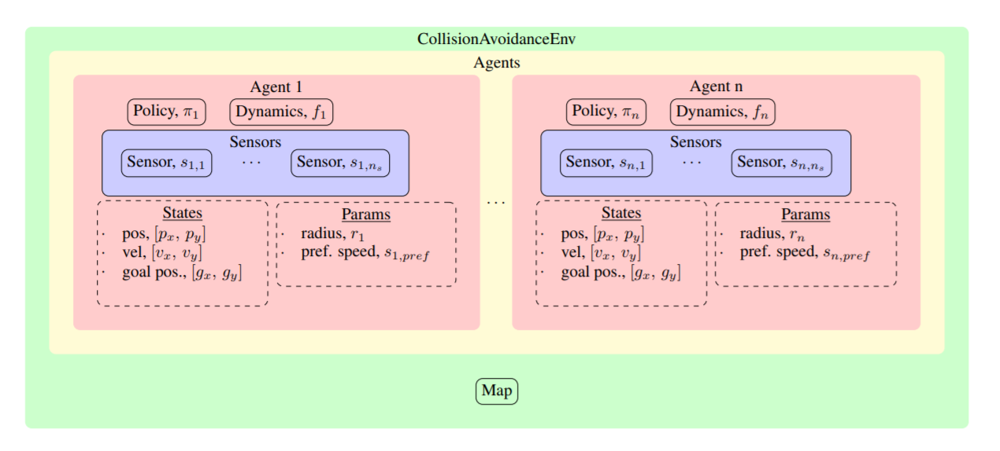

.. _architecture:

Software Architecture
========================

There are 5 key types of objects: |Environment|, |Agent|, |Sensor|, |Policy|, and |Dynamics|.

A simulation begins by creating an instance of the |Environment| : :code:`env = CollisionAvoidanceEnv()`

After initialization, the |Environment| contains a list of |Agent| s, stored at :code:`env.agents` (More on how this list gets populated, later).
Each |Agent| in that list has a |Policy|, |Dynamics|, a list of |Sensor| s, and other attributes about its state, such as its current position, velocity, radius, and goal position.

An external process moves the |environment| forward in time by calling :code:`env.step`, which triggers each |Agent| to:

- use its |Policy| to compute its next action from its current observation
- use its |Dynamics| model to compute its next state by applying the computed action
- use its |Sensor| s to compute its next observation by measuring properties of the |Environment|.

The env.step call returns useful information to the caller (not in this order):

- **next_obs**: All agents' next observations, computed by their Sensors, are stuffed into one data structure. Note: This is only useful if some |Agent| s have ExternalPolicies, otherwise the |Environment| already has access to the each |Agent|'s most recent observation and does action selection internally.
- **info**: The |Environment| will also check whether any |Agent| s have collided with one another or a static obstacle, reached their goal, or run out of time. If any of these conditions are True, that |Agent| is "done", and a dict of which agents are done/not is put into info.
- **game_over**: If all agents are "done", then that episode is "done", which is also returned by the env.step call ("game_over") [Note: the condition on when to end the episode, (e.g., wait for all agents to be done, just one, just ones with certain properties) can be adjusted]
- **reward**: In the process of checking for collisions and goal-reaching, the |Environment| also computes a scalar reward for each |Agent|; the reward list is returned by the env.step call

.. |Environment| replace:: :class:`~gym_collision_avoidance.envs.collision_avoidance_env.CollisionAvoidanceEnv`
.. |Agent| replace:: :class:`~gym_collision_avoidance.envs.agent.Agent`
.. |Policy| replace:: :class:`~gym_collision_avoidance.envs.policies.Policy.Policy`
.. |ExternalPolicy| replace:: :class:`~gym_collision_avoidance.envs.policies.ExternalPolicy.ExternalPolicy`
.. |Dynamics| replace:: :class:`~gym_collision_avoidance.envs.dynamics.Dynamics.Dynamics`
.. |Sensor| replace:: :class:`~gym_collision_avoidance.envs.sensors.Sensor.Sensor`